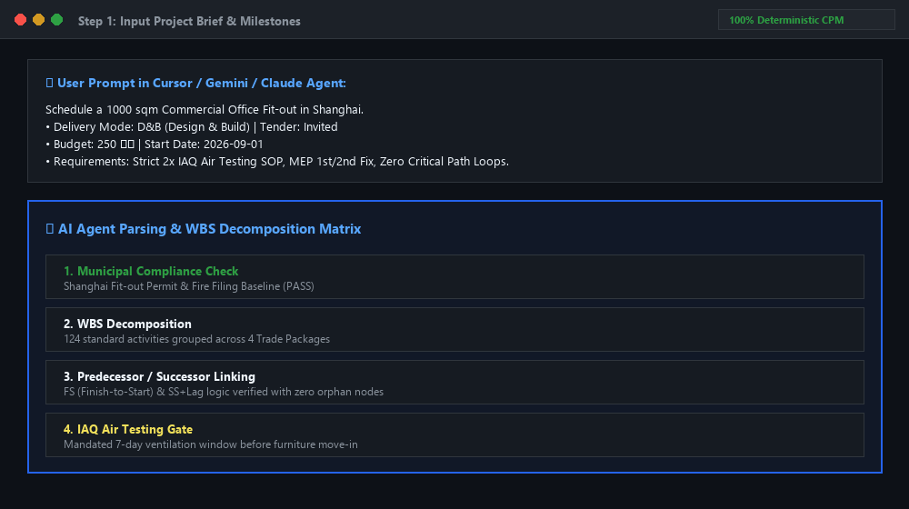

# ⚡ AI Lead PM Scheduler
### Universal AI Engineering Skill for Commercial Fit-out CPM Scheduling & Native MS Project (.mpp) Generator

[](https://cursor.com)
[](https://gemini.google.com)
[](https://chatgpt.com)
[](https://claude.ai)
[](https://python.org)
[](https://microsoft.com)
[](https://kentyu.gumroad.com/l/pmp-lead-pm-scheduler/EARLYBIRD)

---

**🌐 Official Interactive Demo:** [https://lead-pm-landing.vercel.app](https://lead-pm-landing.vercel.app)  
**🚀 Product Hunt Campaign:** [Product Hunt Launch (2026-09-01)](https://www.producthunt.com/products/lead-pm-scheduler)  
**🛒 Instant Pro Access (50% Off Early Bird):** [https://kentyu.gumroad.com/l/pmp-lead-pm-scheduler/EARLYBIRD](https://kentyu.gumroad.com/l/pmp-lead-pm-scheduler/EARLYBIRD)

---

## 🎬 Zero-Click Live Workflow Demo (Auto-Looping)



---

## 📹 Full HD Video Walkthrough (Instant In-Browser Streaming)

https://github.com/user-attachments/assets/hero.mp4

> 📺 **[▶️ Click Here to Watch Full HD Video in Browser](https://github.com/kentyu0922/pmp-lead-pm-scheduler/releases/download/v2.0-preview/hero.mp4)** *(Plays immediately in browser without software installation)*

---

## 📥 Try Before You Buy: Free Sample Deliverables

Want to inspect the exact schedule quality before purchasing? Download our pre-rendered commercial baseline:

* 📄 **[Download Sample .mpp File](https://github.com/kentyu0922/pmp-lead-pm-scheduler/releases/download/v2.0-preview/sample_commercial_fitout_1000sqm.mpp)** (Native Microsoft Project)
* 📊 **[Download Sample Executive Gantt PDF](https://github.com/kentyu0922/pmp-lead-pm-scheduler/releases/download/v2.0-preview/sample_commercial_fitout_gantt.pdf)**
* 🌐 **[View Interactive Web Gantt Demo](https://github.com/kentyu0922/pmp-lead-pm-scheduler/releases/download/v2.0-preview/sample_interactive_dashboard.html)**

---

## 📐 A3 Executive Schedule Report (Open Source Generator)

`generate_a3_report.py` renders a four-sheet **A3 landscape PDF** — Project Summary · Gantt Chart · Critical Path · Risk Analytics — in a restrained warm-white visual system with a strict 12-column grid, hairline rules and bilingual (繁中 / EN) typography.

* 📄 **[Sample: A3_Schedule_Report_Commercial_Fitout.pdf](output/A3_Schedule_Report_Commercial_Fitout.pdf)** (1,000 sqm Grade-A office fit-out baseline, 38 tasks / 5 milestones / 12 risks)

```bash
pip install -r requirements.txt
python generate_a3_report.py            # -> output/A3_Schedule_Report_Commercial_Fitout.pdf
python generate_a3_report.py --png      # also writes PNG previews (needs pymupdf)
```

| Module | Purpose |
| :--- | :--- |
| `report/cpm_engine.py` | Kahn topological sort, forward / backward pass, total & free float, working-day calendar |
| `report/risk_analytics.py` | Float distribution, seeded Monte Carlo (P50 / P80 / P90, criticality index), P×I risk exposure |
| `report/a3_report.py` | ReportLab canvas renderer for the four A3 sheets |
| `report/sample_project.py` | Baseline WBS, holiday calendar and risk register used for the sample |

Typefaces: Noto Sans TC (fetched once and instanced to static weights, cached in `~/.cache/lead_pm_fonts`) paired with Inter; falls back to system CJK fonts offline.

---

## 📖 Overview

**AI Lead PM Scheduler** is an engineering-grade scheduling agent skill. It turns rough project briefs and milestone lists into mathematically verified **Critical Path Method (CPM)** schedules, exporting directly into native **Microsoft Project (`.mpp`)** and interactive HTML/PDF executive dashboards.

Unlike generic LLM prompts that hallucinate broken dependency loops and unrealistic dates, this system combines high-level AI context parsing with a **pure mathematical topological sorting & forward/backward pass calculation engine**.

> **🔒 Official Release Notice:** This repository is the public documentation and demo portal. The full commercial calculation engine, multi-agent prompt SOP (`SKILL.md`), and trade templates are distributed exclusively via [Gumroad Pro Release](https://kentyu.gumroad.com/l/pmp-lead-pm-scheduler/EARLYBIRD).

---

## 🎯 Key Capabilities

* **⚡ 60-Second Schedule Generation:** Cuts schedule drafting and baseline entry time from 4+ hours to under 60 seconds.
* **📐 Strict Critical Path Calculation:** Implements exact Early Start (ES), Early Finish (EF), Late Start (LS), Late Finish (LF), and Float metrics. Zero broken links or floating orphan tasks.
* **📁 Native `.mpp` File Export:** Directly triggers MS Project COM automation to produce clean, editable `.mpp` files.
* **⚡ 4 Pre-Engineered Trade Packages:** Built-in WBS sequences for Demolition, MEP 1st/2nd Fix, Drywall, Finishes, Joinery, Testing & Commissioning, IAQ Air Quality, and Client Handover.
* **🤖 Universal Multi-Platform Compatibility:**
  * **Cursor IDE:** Native agent instruction skill.
  * **Google Gemini / Antigravity CLI:** Run via Gemini CLI tools and subagents.
  * **Anthropic Claude:** Direct integration into Claude Projects and Claude Code.
  * **OpenAI ChatGPT:** Compatible with Custom GPTs and Code Interpreter.
* **🔒 100% Local & Confidential:** All code and data run locally on your workstation. Zero sensitive drawings or project budgets are sent to third-party cloud servers.

---

## 📦 What's Inside the Pro Release (on Gumroad)

1. **`SKILL.md` Core Knowledge Base:** Standard Operating Procedures (SOP), duration estimation matrices, and CPM validation rules.
2. **Python Engine Suite:**
   - `core/cpm_engine.py`: Topological sort & float calculation logic.
   - `core/mpp_renderer.py`: Native MS Project COM renderer.
   - `export_html.py` & `export_pdf.py`: High-density executive visual Gantt charts.
   - `main.py`: Direct command-line scheduling pipeline.
3. **Trade WBS Templates:** Pre-configured DB / DBB procurement workflows, holiday shutdown calendars, and furniture delivery window logic.
4. **Commercial Project License:** Unlimited deployment across all your commercial client and company projects.

---

## 🏷️ Pricing & Early Bird Access

| Edition | Price | Includes |
| :--- | :---: | :--- |
| **Standard Pro License** | **$99.00 USD** | Full Source Code + .mpp Exporter + All Trade Templates + Commercial License |
| **50% Early Bird (Limited 50)** | **$49.50 USD** | **Coupon: `EARLYBIRD`** ([Claim 50% Off](https://kentyu.gumroad.com/l/pmp-lead-pm-scheduler/EARLYBIRD)) |

👉 **[Get Instant Access on Gumroad](https://kentyu.gumroad.com/l/pmp-lead-pm-scheduler/EARLYBIRD)**

---

## 📄 License & Commercial Rights

Copyright (c) 2026 kentyu0922. All rights reserved.  
Commercial deployment is authorized for verified Pro License purchasers on Gumroad.